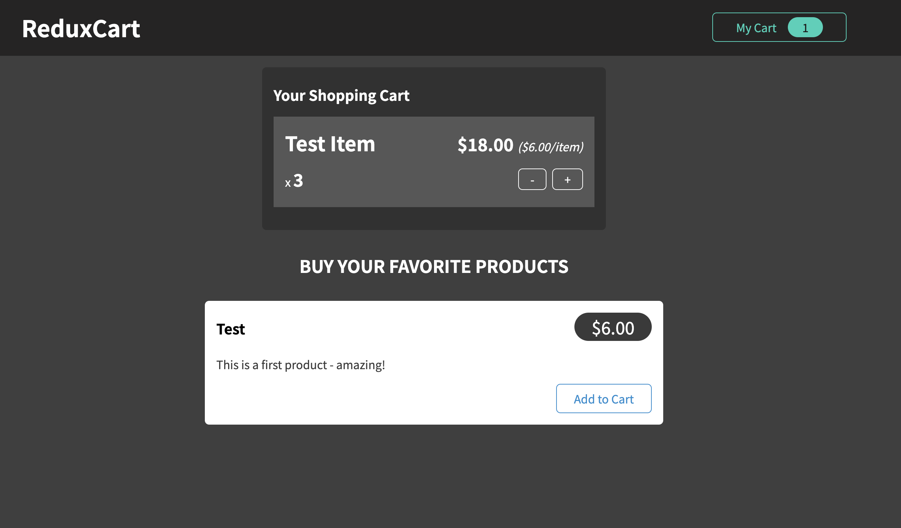

# Shopping Redux

A simple shopping app using redux.

## Tech Stack

## Screenshots

## Lessons Learned

What did you learn while building this project? What challenges did you face and how did you overcome them?

- I learned how to use redux... Still need to spend more time with it to get comfortable with the syntax and all, but it seems super powerful.
- I learned about the basic logic that makes up a shopping list.
- I practiced testing components

- It was difficult to get my tests working because I was using an old version of react/rtl/etc... It took some troubleshooting but I googled my way through it.

## Acknowledgements

- [readme.so](https://readme.so/editor)
- [Udemy - react-the-complete-guide-incl-redux](https://www.udemy.com/course/react-the-complete-guide-incl-redux/)
- [Simple Icons](https://simpleicons.org/?q=redux)
- [shields.io](https://shields.io/)
